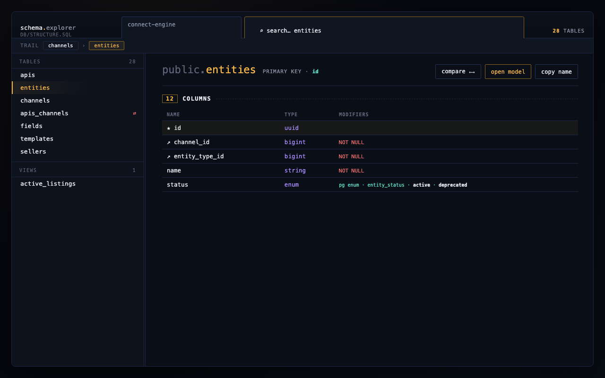
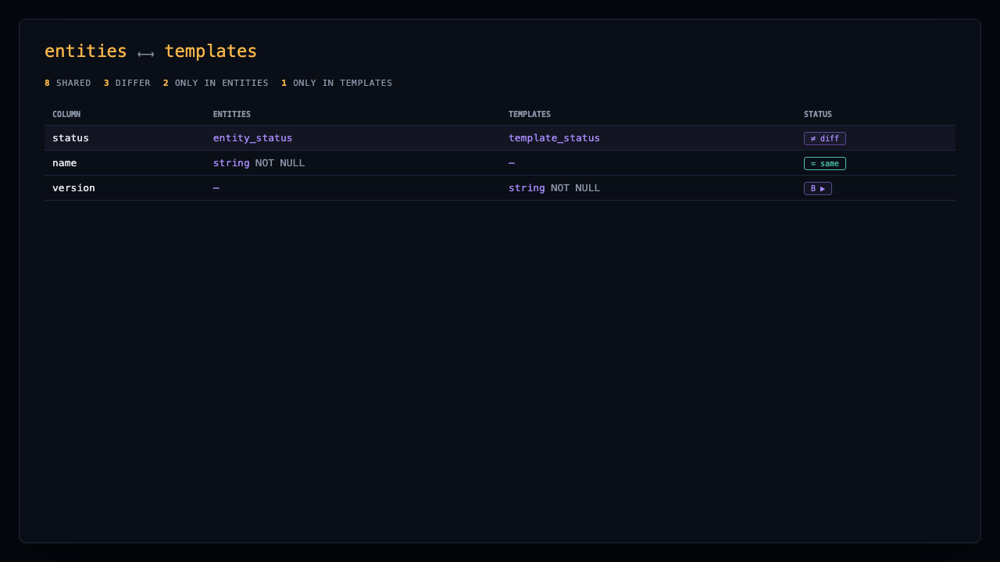

# Rails Schema Explorer

<p align="center">
  
</p>

**Interactive explorer for Rails `db/structure.sql` and `db/schema.rb`.**

Turn a 2,000-line PostgreSQL dump or Rails schema file into a searchable UI — tables, columns, foreign keys, constraints, PostgreSQL enums, views, join tables, and one-click jumps to `app/models`.

Works in **VS Code** and **Cursor**. This extension is **Rails-only** (not Prisma, MySQL dumps, or generic SQL).

<p align="center">
  
</p>

## Why use it

| Problem | How this helps |
|---------|----------------|
| Scrolling `structure.sql` to find a column | Instant search across tables and columns |
| Tracing FK relationships by hand | Click incoming/outgoing FK links to navigate |
| Spotting join / pivot tables | Join tables show a **⇄** badge in the sidebar |
| Jumping between schema and models | Open model from a table, or open explorer from a model file |
| Comparing two tables during a PR | Built-in **Compare** mode with column-by-column diff |
| Stale schema after migrations | Banner with dump command, open file, run in terminal, refresh |

## Requirements

- VS Code **1.85+** or **Cursor**
- A Rails project with `db/structure.sql` **or** `db/schema.rb` in the workspace

## Install

### From VS Code Marketplace

1. Open **Extensions** (`Cmd+Shift+X` / `Ctrl+Shift+X`)
2. Search **Rails Schema Explorer**
3. Click **Install**
4. Open a Rails repo that contains a schema file

Or from the command line:

```bash
code --install-extension <your-publisher>.rails-schema-explorer
```

### From VSIX (teams / offline)

```bash
npm run compile
npx @vscode/vsce package --no-dependencies
code --install-extension rails-schema-explorer-1.0.0.vsix
```

Reload the window after installing.

## Quick start

1. Open a Rails app in VS Code / Cursor
2. Press **`Cmd+Alt+S`** (macOS) or **`Ctrl+Alt+S`** (Windows/Linux)  
   — or run **`Rails Schema: Open Explorer`** from the Command Palette
3. Click a table in the sidebar to inspect columns, constraints, and FKs

**From the editor**

- Open `db/structure.sql` or `db/schema.rb` → click the **database** icon in the editor title bar
- Open any `app/models/*.rb` file (not concerns) → **Open Explorer for Model** jumps to that table

## Features

### Schema sources

- **`db/structure.sql`** — PostgreSQL dump (tables, views, PG enums, domains, indexes, constraints)
- **`db/schema.rb`** — Rails schema DSL including `create_enum` / `t.enum`

### Sidebar

- **Tables** — click to open detail view; join tables show **⇄**
- **Views** — PostgreSQL views (from `structure.sql`)
- **Search** — filter tables and columns; press **`/`** to focus search

Search prefixes:

| Prefix | Filters |
|--------|---------|
| `t:` | Tables only |
| `c:` or `col:` | Columns only |
| `v:` | Views only |

### Table detail

Collapsible sections per table (state saved per table):

- **Columns** — type, NOT NULL, DEFAULT, UNIQUE, index chips, enum values
- **Table constraints** — indexes, unique, partial indexes, CHECK, exclude
- **Incoming / outgoing FKs** — click to navigate to related tables
- **Many-to-many** — join tables linking two entities

**Header actions**

- **Compare** — side-by-side column comparison with another table
- **Open model** — opens `app/models/...` when a model exists (including join/pivot models)
- **Copy name** — copies the table name

<p align="center">
  
</p>

### Rails integration

- Scans **`app/models`** for Rails enums and shows them on columns
- **Open model** from table header
- **Open explorer from model** from the model editor title bar
- Join table detection (strict joins and named pivots like `apis_channels`)

### Multi-project workspaces

When several Rails apps are in one workspace:

- Header **project picker** (30% width) + table search (70%)
- **`Rails Schema: Switch Project`** from Command Palette
- Optionally **follow the active editor** (see Settings)

### Stale schema banner

If the schema file is older than recent migrations:

- Copy `rails db:structure:dump` (or equivalent) command
- Open schema file
- Run dump in terminal
- Refresh explorer

## Keyboard shortcuts

| Action | Command | macOS | Win/Linux |
|--------|---------|-------|-----------|
| Open explorer | `Rails Schema: Open Explorer` | `Cmd+Alt+S` | `Ctrl+Alt+S` |
| Find table | `Rails Schema: Find Table` | `Ctrl+Shift+J` | `Ctrl+Shift+J` |
| Refresh | `Rails Schema: Refresh` | `Cmd+Shift+R` * | `Ctrl+Shift+R` * |
| Switch project | `Rails Schema: Switch Project` | — | — |

\* When the explorer panel is focused.

## Settings

| Setting | Default | Description |
|---------|---------|-------------|
| `schemaExplorer.followEditor` | `true` | Active schema project follows the editor; disable to pin a project |
| `schemaExplorer.showStatusBar` | `true` | Show active schema project in the status bar |

Open **Settings** and search for `schemaExplorer`.

## Use cases

- **Onboarding** — understand tables, FKs, and join relationships without reading raw SQL
- **PR review** — verify migrations, indexes, and constraints in context
- **Debugging** — trace FK paths and M2M join tables quickly
- **Model ↔ DB** — jump between schema and `app/models`
- **Large schemas** — search and filter instead of scrolling `structure.sql`

## Develop from source

```bash
cd schema-explorer-vscode
npm install
npm run compile
```

Press **F5** to launch an Extension Development Host.

## Publish to VS Code Marketplace

Before your first publish:

1. Create a [publisher](https://marketplace.visualstudio.com/manage) at Visual Studio Marketplace
2. Set `"publisher"` in `package.json` to your publisher ID (replace `"local"`)
3. Optionally add `"repository"`, `"homepage"`, and `"bugs"` URLs

```bash
npm run compile
npx @vscode/vsce login <your-publisher>
npx @vscode/vsce publish
```

## Project layout

```
schema-explorer-vscode/
├── src/
│   ├── parser.ts              # structure.sql + schema.rb parsing
│   ├── schemaIndex.ts         # Load/cache schema per project
│   ├── modelIndex.ts          # Rails enum + model scanning
│   └── schemaExplorerPanel.ts
├── media/
│   └── schema-explorer.html   # Explorer UI (webview)
├── images/                    # Icon + README screenshots
└── package.json
```

## License

MIT License
